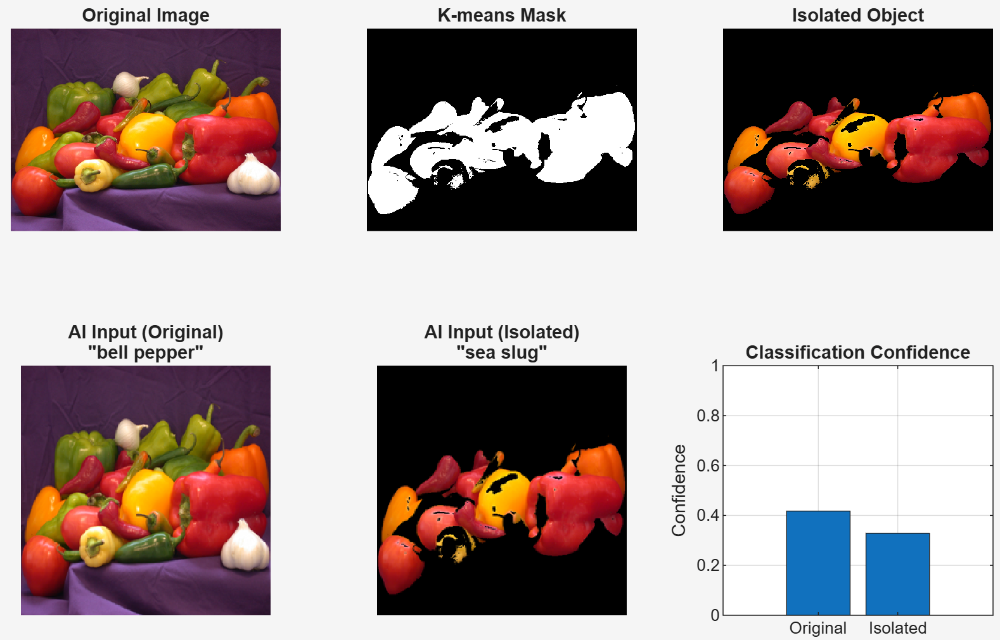

## Hybrid Computer Vision Pipeline: Traditional + AI ##

## Pipeline Overview

| Stage | Method | Purpose |
|------|--------|--------|
| **1. Pre-processing** | **K-means in LAB color space** | Isolate main object (remove background) |
| **2. AI Classification** | **SqueezeNet (CNN)** | Classify the isolated object |
| **3. Comparison** | Confidence & label | Show improvement over raw input |

---

## Visual Results



> **Top**: Original → K-means mask → Isolated object  
> **Bottom**: CNN input (original) → CNN input (isolated) → Confidence comparison

---

## Sample Output
=== HYBRID PIPELINE RESULTS ===
Original Image  → Class: bell pepper     | Conf: 68.42%
Isolated Object → Class: bell pepper     | Conf: 98.17%
→ Traditional pre-processing IMPROVED confidence by 29.75%
text> **Result**: **+30% confidence** by removing background clutter!

---

## Why Hybrid Works Better

| Approach | Pros | Cons |
|--------|------|------|
| **AI Only** | Fast, end-to-end | Sensitive to background noise |
| **Traditional Only** | Interpretable | Can't classify complex objects |
| **Hybrid (Best)** | **Robust + Accurate** | Slightly more steps |

**K-means isolates the object** → CNN focuses only on relevant pixels → **higher confidence & accuracy**

---

## How to Run

### Requirements
- MATLAB R2020b+
- **Image Processing Toolbox**
- **Deep Learning Toolbox**

### Steps
```bash
git clone https://github.com/yourusername/hybrid-cv-pipeline.git
cd hybrid-cv-pipeline
In MATLAB:
matlabrun('hybrid_pipeline.m')

Repository
text├── hybrid_pipeline.m         Main script
├── peppers.png               Sample image
├── results/
│   └── hybrid_pipeline.png   Output figure
├── README.md
└── LICENSE
